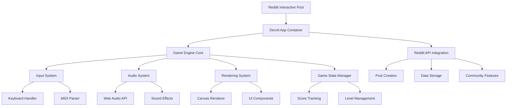

# Design Document

## Overview

Muse Runner is a rhythm-platformer game built as a Reddit Interactive Post using the Devvit framework. The game combines real-time musical input with platformer mechanics, where players control an auto-running character by playing MIDI notes on their keyboard. The design emphasizes community engagement through post generation, leaderboards, and shared challenges.

### Core Game Loop

1. Character auto-runs forward at constant speed
2. MIDI notes appear in a Guitar Hero-style note highway
3. Players press keyboard keys (S-D-F-G-H-J-K) to match notes
4. Correct timing generates platform segments; missed notes create gaps
5. Character falls through gaps, ending the game
6. Performance metrics are tracked and can be shared as new Interactive Posts

## Architecture

### High-Level Architecture



### Technology Stack

- **Platform**: Reddit Devvit Framework
- **Runtime**: JavaScript/TypeScript in Devvit environment
- **Game Engine**: Phaser.js 3.x for rendering, physics, and game management
- **Audio**: Phaser's Audio system with Web Audio API fallback
- **Input**: Phaser's Input system for keyboard handling
- **Storage**: Devvit's built-in data storage (Redis-backed)
- **Networking**: Devvit's Reddit API integration

## Components and Interfaces

### 1. Game Engine Core

**GameEngine Class (Phaser Scene)**

```typescript
interface GameEngine extends Phaser.Scene {
  initialize(): Promise<void>;
  create(): void;
  update(time: number, delta: number): void;
  pauseGame(): void;
  resetGame(): void;
}
```

**Responsibilities:**

- Extends Phaser.Scene for built-in game loop management
- Coordinates between Phaser systems and custom game logic
- Manages scene transitions and game states

### 2. Input System

**InputManager Class**

```typescript
interface InputManager {
  initialize(): void;
  bindKeyboardEvents(): void;
  getCurrentInput(): InputState;
  getKeyMapping(): KeyMap;
  setKeyMapping(mapping: KeyMap): void;
}

interface KeyMap {
  [key: string]: MusicalNote;
}

interface InputState {
  pressedKeys: Set<string>;
  keyTimestamps: Map<string, number>;
}
```

**Key Features:**

- Maps keyboard keys (S-D-F-G-H-J-K) to musical notes
- Tracks timing for accuracy scoring
- Supports customizable key bindings
- Handles simultaneous key presses for chords

### 3. Audio System

**AudioManager Class**

```typescript
interface AudioManager {
  initialize(): Promise<void>;
  playNote(note: MusicalNote, volume?: number): void;
  playBackgroundTrack(track: AudioTrack): void;
  playSoundEffect(effect: SoundEffect): void;
  setMasterVolume(volume: number): void;
}

interface MusicalNote {
  frequency: number;
  duration: number;
  velocity: number;
}
```

**Implementation Details:**

- Uses Web Audio API for low-latency note playback
- Generates musical tones programmatically for consistent sound
- Manages background music that complements MIDI sequences
- Provides audio feedback for game events

### 4. MIDI System

**MIDIParser Class**

```typescript
interface MIDIParser {
  loadSequence(midiData: ArrayBuffer): MIDISequence;
  parseNotes(sequence: MIDISequence): GameNote[];
  validateSequence(sequence: MIDISequence): boolean;
}

interface MIDISequence {
  tracks: MIDITrack[];
  ticksPerQuarter: number;
  tempo: number;
}

interface GameNote {
  note: MusicalNote;
  timing: number;
  duration: number;
  lane: number;
}
```

**Features:**

- Parses standard MIDI files into game-compatible format
- Filters notes to stay within single musical scale
- Converts MIDI timing to game timing
- Supports tempo changes and time signatures

### 5. Rendering System

**Renderer (Phaser Graphics System)**

```typescript
interface GameRenderer {
  createCharacterSprite(): Phaser.GameObjects.Sprite;
  createPlatformGroup(): Phaser.GameObjects.Group;
  createNoteHighway(): Phaser.GameObjects.Container;
  createParticleSystem(): Phaser.GameObjects.Particles.ParticleEmitter;
  updateUI(gameState: GameState): void;
}
```

**Visual Design:**

- Leverages Phaser's built-in sprite system and animations
- Uses Phaser's particle system for visual effects
- Phaser's automatic batching for optimal performance
- Responsive scaling using Phaser's Scale Manager

### 6. Game State Management

**GameStateManager Class**

```typescript
interface GameStateManager {
  getCurrentState(): GameState;
  transitionTo(newState: GameStateType): void;
  saveProgress(): void;
  loadProgress(): GameState;
}

interface GameState {
  score: number;
  accuracy: number;
  streak: number;
  survivalTime: number;
  currentLevel: string;
  character: Character;
  platforms: Platform[];
  activeNotes: GameNote[];
}
```

### 7. Reddit Integration

**RedditIntegration Class**

```typescript
interface RedditIntegration {
  createPerformancePost(performance: Performance): Promise<string>;
  updateLeaderboard(score: ScoreEntry): Promise<void>;
  getLeaderboard(): Promise<ScoreEntry[]>;
  createDailyChallenge(midiSequence: MIDISequence): Promise<string>;
  shareCustomSequence(sequence: MIDISequence): Promise<string>;
}

interface Performance {
  score: number;
  accuracy: number;
  survivalTime: number;
  midiSequence: string;
  replayData: ReplayFrame[];
}
```

## Data Models

### Core Game Objects

**Character Model**

```typescript
interface Character {
  position: Vector2;
  velocity: Vector2;
  isGrounded: boolean;
  animationState: AnimationState;
  runSpeed: number;
}
```

**Platform Model**

```typescript
interface Platform {
  position: Vector2;
  width: number;
  height: number;
  isGenerated: boolean;
  creationTime: number;
}
```

**Note Model**

```typescript
interface GameNote {
  id: string;
  musicalNote: MusicalNote;
  timing: number;
  lane: number;
  hitWindow: TimeWindow;
  isHit: boolean;
  accuracy?: number;
}

interface TimeWindow {
  perfect: number;
  good: number;
  okay: number;
}
```

### Persistence Models

**Score Entry**

```typescript
interface ScoreEntry {
  userId: string;
  username: string;
  score: number;
  accuracy: number;
  survivalTime: number;
  timestamp: number;
  levelId: string;
}
```

**Level Data**

```typescript
interface Level {
  id: string;
  name: string;
  midiSequence: MIDISequence;
  difficulty: DifficultyLevel;
  createdBy: string;
  playCount: number;
  averageScore: number;
}
```

## Error Handling

### Error Categories

1. **Audio Errors**

   - Web Audio API initialization failures
   - Audio context suspension (user interaction required)
   - Missing audio permissions

2. **Input Errors**

   - Keyboard event binding failures
   - Key mapping conflicts
   - Input lag detection

3. **MIDI Parsing Errors**

   - Invalid MIDI file format
   - Unsupported MIDI features
   - Sequence validation failures

4. **Reddit API Errors**
   - Post creation failures
   - Data storage errors
   - Network connectivity issues

### Error Recovery Strategies

**Graceful Degradation**

- Audio failures: Continue with visual-only feedback
- Network errors: Cache data locally and retry
- MIDI errors: Provide fallback sequences

**User Communication**

- Clear error messages with suggested actions
- Progress indicators for loading operations
- Fallback options when features are unavailable

## Testing Strategy

### Unit Testing

- **Input System**: Key mapping, timing accuracy, simultaneous inputs
- **Audio System**: Note generation, volume control, timing precision
- **MIDI Parser**: File parsing, note extraction, validation
- **Game Logic**: Scoring algorithms, collision detection, state transitions

### Integration Testing

- **Reddit Integration**: Post creation, data storage, API interactions
- **Audio-Visual Sync**: Note timing with visual feedback
- **Performance**: Frame rate stability, memory usage, loading times

### User Acceptance Testing

- **Gameplay Flow**: Complete game sessions from start to finish
- **Accessibility**: Keyboard remapping, visual indicators, responsive design
- **Community Features**: Leaderboards, post sharing, daily challenges

### Performance Testing

- **Target Metrics**:
  - Game startup: < 3 seconds
  - Frame rate: 60 FPS sustained
  - Audio latency: < 50ms
  - Memory usage: < 100MB

### Browser Compatibility

- **Primary Targets**: Chrome, Firefox, Safari, Edge (latest versions)
- **Mobile Considerations**: Touch-friendly fallbacks, responsive layout
- **Accessibility**: Screen reader compatibility, keyboard navigation

## Security Considerations

### Input Validation

- Sanitize all user-generated MIDI sequences
- Validate score submissions for tampering
- Rate limiting for post creation

### Data Privacy

- Minimal data collection (scores, usernames only)
- Compliance with Reddit's privacy policies
- No sensitive information storage

### Performance Security

- Prevent infinite loops in MIDI parsing
- Memory leak prevention in audio system
- Resource usage monitoring and limits
